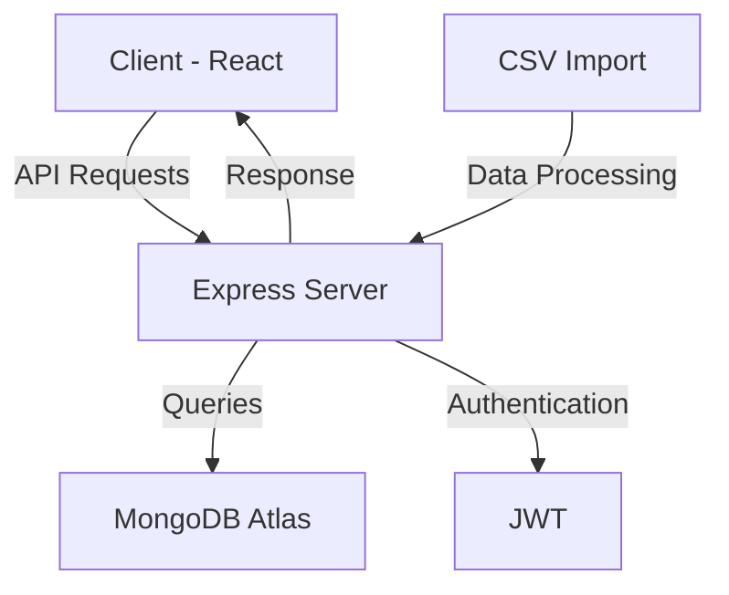
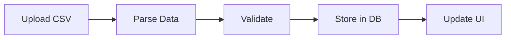

# FinBot - Personal Finance Manager 📊

<div align="center">
  
  <p><strong>Your Personal Finance Tracking Solution</strong></p>
</div>

## 📑 Table of Contents
- [Overview](#overview)
- [Features](#features)
- [System Architecture](#system-architecture)
- [Technology Stack](#technology-stack)
- [Installation](#installation)
- [Environment Setup](#environment-setup)
- [Usage Guide](#usage-guide)
- [API Documentation](#api-documentation)
- [Contributing](#contributing)

## 🎯 Overview

FinBot is a comprehensive personal finance management application that helps users track their income, expenses, and financial goals. With an intuitive interface and powerful features, it makes financial management accessible and efficient.

## ✨ Features

### 1. Transaction Management
- 📋 Import transactions from CSV files (PhonePe statement compatible)
- 💰 Track income and expenses
- 🏷️ Automatic transaction categorization
- 📊 Detailed transaction history

### 2. Financial Analytics
- 📈 Monthly income/expense charts
- 💹 Trend analysis
- 📊 Category-wise expense breakdown
- 💸 Real-time balance tracking

### 3. User Experience
- 🌓 Dark mode interface
- 📱 Responsive design
- 🔐 Secure authentication
- 📤 CSV data export

## 🏗️ System Architecture



## 🛠️ Technology Stack

### Frontend
- **React** - UI library
- **Redux Toolkit** - State management
- **TailwindCSS** - Styling
- **Recharts** - Data visualization
- **Papa Parse** - CSV parsing

### Backend
- **Node.js** - Runtime environment
- **Express** - Web framework
- **MongoDB Atlas** - Database
- **JWT** - Authentication
- **Mongoose** - ODM

## 📥 Installation

1. **Clone the Repository**
```bash
git clone https://github.com/yourusername/FinBot.git
cd FinBot
```

2. **Install Dependencies**
```bash
# Install server dependencies
cd server
npm install

# Install client dependencies
cd ../client
npm install
```

## ⚙️ Environment Setup

1. **Server Configuration** (.env)
```env
PORT=5000
MONGODB_URI=your_mongodb_atlas_uri
JWT_SECRET=your_secret_key
```

2. **Client Configuration** (.env)
```env
REACT_APP_API_URL=http://localhost:5000
```

## 📱 Usage Guide

### 1. User Authentication
- Register with email and password
- Login to access features
- Secure JWT-based sessions

### 2. Transaction Management


### 3. CSV Import Steps
1. Download statement from PhonePe
2. Click "Upload CSV" in FinBot
3. Select your statement file
4. Verify imported transactions

### 4. Analytics Features
- View monthly summaries
- Track spending patterns
- Export reports

## 🔌 API Documentation

### Authentication Endpoints
```http
POST /api/auth/register
POST /api/auth/login
GET /api/auth/profile
```

### Transaction Endpoints
```http
POST /api/transactions/import
GET /api/transactions
POST /api/transactions
DELETE /api/transactions/:id
```

## 💻 Development

```bash
# Run development server
cd server
npm run dev

# Run client
cd client
npm start
```

## 🤝 Contributing

1. Fork the repository
2. Create feature branch
3. Commit changes
4. Push to branch
5. Open pull request

## 📄 License

This project is licensed under the MIT License - see the [LICENSE](LICENSE) file for details.

## 👥 Contact

- GitHub: [@yourusername](https://github.com/yourusername)
- Email: your.email@example.com

---

<div align="center">
  <p>Made with ❤️ by [Your Name]</p>
</div>
